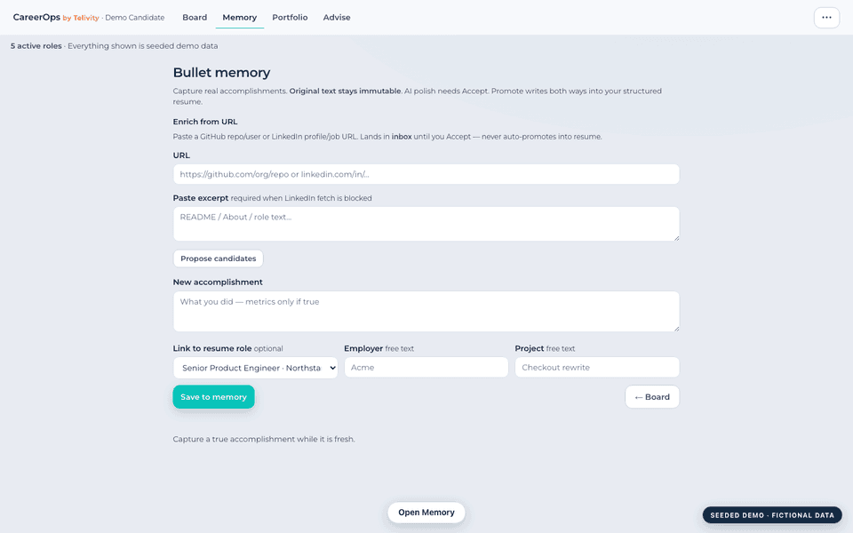
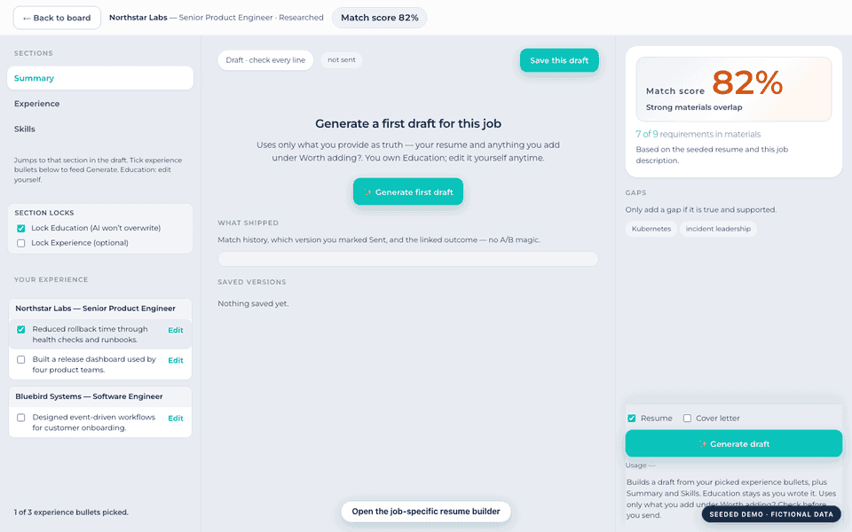
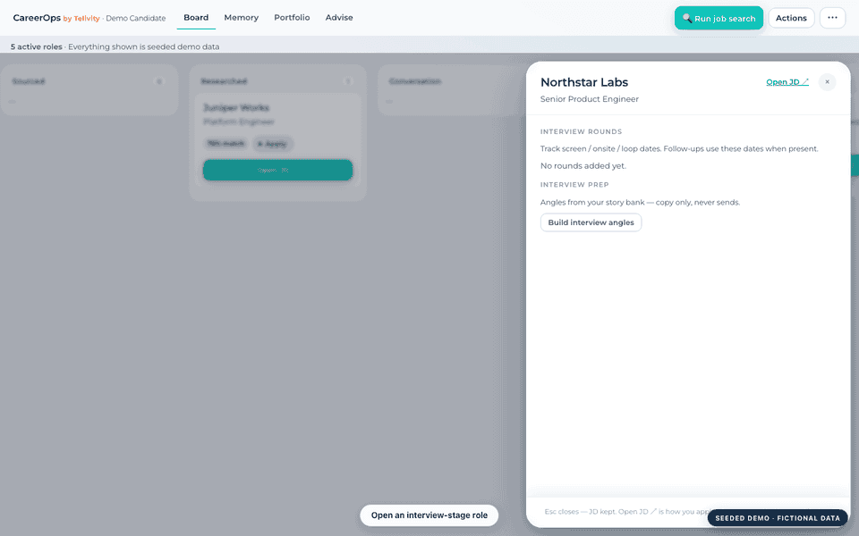
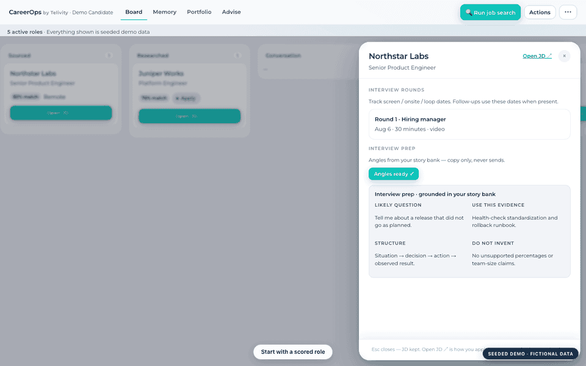
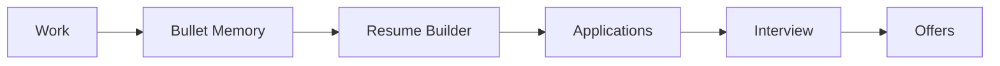
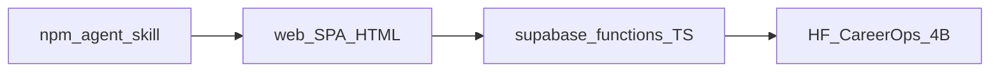

# CareerOps

> Stop rebuilding your career from scratch every time you look for a job.
>
> CareerOps is a local-first, open-source Career Operating System that remembers your accomplishments, tailors resumes, tracks applications, prepares interviews, and never invents experience.

[](https://github.com/TelivityAI/careerops/actions/workflows/smoke.yml)
[](LICENSE)
[](https://github.com/TelivityAI/careerops/releases/latest)
[](https://careerops.telivity.app)



*Capture a real accomplishment → promote it into your resume. Seeded demo profile only — see [docs/assets/](docs/assets/).*

## Quick start (≈5 minutes)

1. **Try it** — open the live demo: [careerops.telivity.app](https://careerops.telivity.app)
2. **Install the agent skill** (scan / evaluate / rank / tailor / interview / followup / outcome / advise):

   ```bash
   npx @telivity/careerops init
   ```

   Details: [docs/SKILL.md](docs/SKILL.md)
3. **Self-host** — clone, point `web/config.js` at *your* Supabase project, apply schema, deploy. Steps below → [Self-host](#self-host). Local contributor path: [CONTRIBUTING.md](CONTRIBUTING.md).

You apply on the employer site. CareerOps does **not** auto-apply.

---

## 30-second story

Monday: production outage. You fix it, ship the postmortem, then… forget the wording by the time you need a resume.

With CareerOps you **capture the bullet while it’s fresh** (immutable original). Later you **promote** it into a role on your structured resume, **tailor** a version for a real JD from ranked memory you already own, **prep interview stories** from the same facts, and track the role through **offer** — without starting from a blank page every search.

Doctrine (materials-first, provenance, no invented experience): [docs/DOCTRINE_MEMORY.md](docs/DOCTRINE_MEMORY.md).

## Demo gallery

<details>
<summary><b>See the rest of the product loop</b> — four short, silent demos + five stills</summary>

### Tailor a resume



### Prepare for an interview



### Track applications



### Compare offers


**Stills:** [Dashboard](docs/assets/dashboard.png) · [Resume builder](docs/assets/resume-builder.png) · [Bullet memory](docs/assets/bullet-memory.png) · [Interview prep](docs/assets/interview-prep.png) · [Offer comparison](docs/assets/offer-compare.png)

All media uses a seeded throwaway profile and fictional companies. Capture notes: [docs/assets/README.md](docs/assets/README.md).

</details>

---

## Why not ChatGPT?

| | ChatGPT (or a blank chat) | CareerOps |
|--|---------------------------|-----------|
| **Memory** | Ephemeral threads; you re-explain yourself each session | Persistent **bullet memory** that compounds across searches |
| **Evidence** | Easy to invent metrics that won’t survive an interview | Drafts are driven from **your** materials; gaps stay labeled gaps |
| **History** | Hard to keep years of work reusable and trustworthy | Structured history you can promote, version, and reuse |
| **Reuse** | Copy-paste into a new doc every time | Kanban → match → builder → Word export → you apply |

Neutral contrast only — ChatGPT is great for drafting prose; CareerOps is the **ops loop** around career evidence. See also [docs/POSITIONING.md](docs/POSITIONING.md).

---

## The career loop



Find roles (default pack of **87** public company boards — [`supabase/boards.default.json`](supabase/boards.default.json)), decide in the drawer, write in the builder, capture memory between searches. Roadmap: [docs/ROADMAP.md](docs/ROADMAP.md).

---

## Built for

Engineers · PMs · designers · consultants · sales · students — anyone who wants a **career OS**, not a one-shot “AI wrote my resume” tool.

---

## What you get

| Area | What it does | Dig deeper |
|------|----------------|------------|
| **Find** | Fill a kanban from verified public ATS boards (or Add role / LinkedIn helper). Hygiene: blocklist, max age, remote prefs, triage. | Board pack + prefs in the app; boards JSON above |
| **Decide** | Drawer: JD provenance, match + materials coverage, Apply/Stretch/Skip as *tags only*. | Same doctrine as memory docs |
| **Write** | Builder: tick bullets → generate from **ranked** memory → edit → append-only versions → Word → you apply. Education locked by default. | [docs/DOCTRINE_MEMORY.md](docs/DOCTRINE_MEMORY.md) |
| **Memory · Portfolio · Advise** | Capture with immutable originals; promote into resume/projects; advisor briefs separate observed materials from labeled judgment. | Doctrine + [docs/ROADMAP.md](docs/ROADMAP.md) |
| **BYO model + skill** | Optional Anthropic / Kimi / OpenAI-compatible keys; board-pack export for offline skill runs (keys never included). | [docs/SKILL.md](docs/SKILL.md), [docs/CHAINS.md](docs/CHAINS.md), [docs/PLUGINS.md](docs/PLUGINS.md) |

Hard product rules (also in the UI): AI may only improve **truth you already provided**; Generate does not rewrite Education; saving **never overwrites** (new version each time); `resume_struct` is canonical.

### Deliberately does *not*

- Auto-apply or LinkedIn automation  
- Invent employers, titles, metrics, or education  
- Treat Apply/Stretch/Skip as “we applied for you”  
- Quietly overwrite saved drafts  

Model **weights** (separate from this app): [CareerOps-4B on Hugging Face](https://huggingface.co/telivity/CareerOps-4B). The live UI goes through Supabase edge functions — it does not load HF weights in the browser.

---

## Architecture



| Public in this repo | Private to you |
|---------------------|----------------|
| SPA (`web/`), edge function source, schema SQL, agent skill, training *code* | Live Supabase project, API keys, your career data, optional custom ATS lists |
| Model weights on Hugging Face | Training datasets / résumé-derived eval sets |

More: [web/README.md](web/README.md), [docs/README.md](docs/README.md).

---

## Self-host

```bash
git clone https://github.com/TelivityAI/careerops.git
cd careerops

# 1) Web config
cp web/config.example.js web/config.js
# edit web/config.js → YOUR Supabase URL + anon key

# 2) Database
# Paste supabase/schema.sql into the Supabase SQL editor (Auth enabled).

# 3) Link + deploy edges then web
export SUPABASE_ACCESS_TOKEN=…          # from `npx supabase login` / dashboard
export SUPABASE_PROJECT_REF=your_ref    # Project Settings → General
npm run deploy                          # functions then web
```

`web/config.js` is gitignored — never commit real keys. Use **your** Supabase project, not the hosted demo credentials.

**Provider secrets (self-host tradeoff):** By default, BYO Claude / Kimi / humanizer credentials can live as **plaintext columns** on `mt_profiles` (simple self-host). The hosted demo does **not** expose those columns to the browser — it stores AES-GCM ciphertext in `mt_provider_secrets` and shows only “key on file”. To match hosted behavior on your project, set edge secret `CREDENTIALS_KEK` (any strong passphrase or 32-byte base64) and deploy `upsert_provider_secret` / `clear_provider_secret`. Without `CREDENTIALS_KEK`, Settings falls back to plaintext profile columns. Migrations never encrypt existing rows in CI (KEK is an edge secret); with KEK set, edge functions lazily migrate plaintext → vault on first use. See [`supabase/README.md`](supabase/README.md).

Optional free-tier secrets: `FREE_AI_ENDPOINT`, `FREE_AI_TOKEN`, `FREE_AI_MODEL`, `FREE_AI_ALLOW`. Override job boards via profile `ats_boards` or `run-search-mt` — see [`supabase/boards.example.json`](supabase/boards.example.json).

| Path | Purpose |
|------|---------|
| `web/` | Dashboard SPA |
| `supabase/functions/` | Edge functions |
| `supabase/schema.sql` | Minimal tables + RLS |
| `training/` | Optional train/eval *code* (datasets not included) |
| `.agents/skills/careerops/` | Open Agent Skill |
| `packages/careerops` | `npx @telivity/careerops init` |
| `scripts/deploy*.sh` | Deploy helpers |

---

## Docs

| Doc | Topic |
|-----|--------|
| [docs/DOCTRINE_MEMORY.md](docs/DOCTRINE_MEMORY.md) | Memory, provenance, promote |
| [docs/ROADMAP.md](docs/ROADMAP.md) | Phases 2–4 |
| [docs/SKILL.md](docs/SKILL.md) | Agent skill modes |
| [docs/CHAINS.md](docs/CHAINS.md) | Human-gated mode chains |
| [docs/PLUGINS.md](docs/PLUGINS.md) | Extension hooks |
| [docs/POSITIONING.md](docs/POSITIONING.md) | Positioning backlog |
| [CONTRIBUTING.md](CONTRIBUTING.md) | How to contribute |
| [SECURITY.md](SECURITY.md) | Vulnerability reporting |
| [CODE_OF_CONDUCT.md](CODE_OF_CONDUCT.md) | Community norms |
| [CHANGELOG.md](CHANGELOG.md) | Releases |
| [docs/assets/](docs/assets/) | Public-safe demo GIFs and stills |

---

## License

Copyright © Telivity and contributors.  
Licensed under the [Apache License, Version 2.0](LICENSE).

Versioning follows git tags (`v1.2.1`, …). Root `package.json` is private; publish the CLI with `cd packages/careerops && npm publish --access public` (or the `Release` workflow when `NPM_TOKEN` is set).
