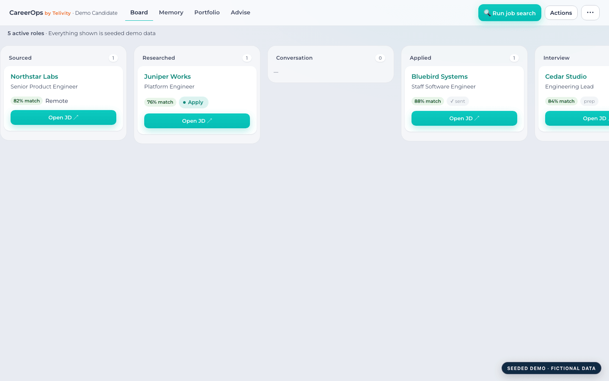
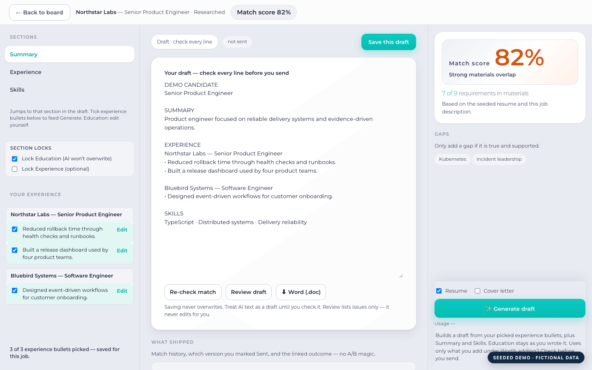
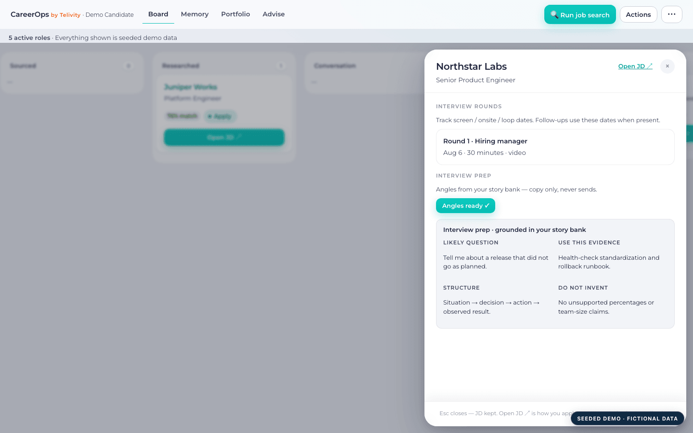
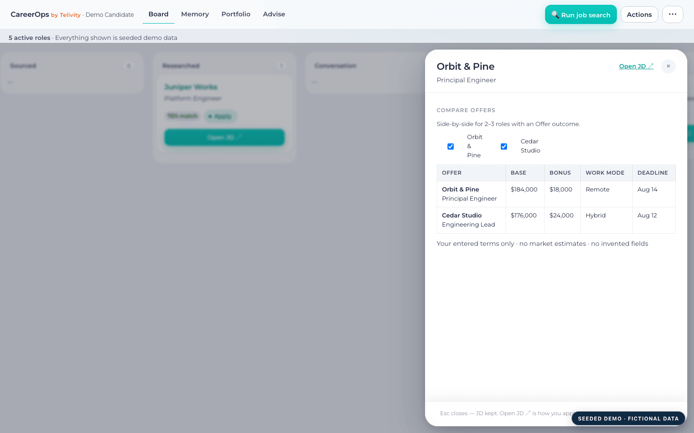
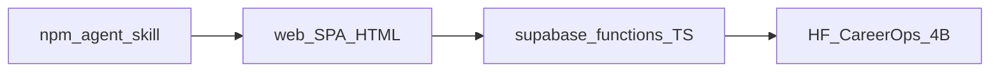

# CareerOps

## Stop rebuilding your career every time you look for a job.

Local-first, open-source Career Operating System that remembers your accomplishments, tailors resumes from real evidence, prepares interviews, tracks applications, compares offers, and keeps career data under your control.

[Live Demo](https://careerops.telivity.app) · [Quick Start](#installation) · [Documentation](docs/)


*Memory → Promote → Resume → Interview*

---

Apache 2.0 · Local-first · Self-host · AI-assisted · No subscriptions

**Everything you need to manage your career. Nothing you don’t.**

---

## Why CareerOps?

| Problem | CareerOps |
|---------|-----------|
| Resume forgotten after every job | Persistent career memory |
| Applications in spreadsheets | Built-in board |
| Interview stories scattered | Story & evidence management |
| Resume builders invent accomplishments | User-authored evidence only |
| Five separate subscriptions | One system |
| Vendor lock-in | Local-first & open source |

---

## Product journey

### 1. Remember what you actually did

Capture accomplishments while they’re fresh. Originals stay immutable; you promote what belongs on a resume when you’re ready.


### 2. Run your job search

Fill a kanban from public ATS boards (or add roles yourself). Triage, track stages, and keep the search in one place—not a spreadsheet.


### 3. Tailor resumes from evidence

Generate drafts from ranked, user-authored memory—not invented metrics. Edit, version, export, then you apply on the employer site.


### 4. Prepare interviews

Pull interview angles from the same story bank and evidence you already captured—no blank-page prep before every round.


### 5. Compare offers

Side-by-side comparison of terms you enter. Decide with structure, not scattered notes.


### 6. Build your portfolio

Promote work into projects and portfolio evidence from the same memory you use for resumes and interviews.


---

## Why not Teal, Huntr, Simplify, LoopCV…

Job trackers and AI resume tools help you apply faster. CareerOps is the operating system underneath: memory, evidence, and provenance you keep.

| | CareerOps | Typical Job Tracker |
|--|-----------|---------------------|
| Local-first | ✅ | ❌ |
| Open source | ✅ | ❌ |
| Own your data | ✅ | Often limited |
| Bullet memory | ✅ | ❌ |
| Portfolio evidence | ✅ | Rare |
| Resume provenance | ✅ | ❌ |
| AI invents accomplishments | ❌ | Often |
| Self-host | ✅ | ❌ |
| Plugins | ✅ | Rare |
| Agent workflows | ✅ | ❌ |
| Forever free | ✅ | ❌ |

You apply on the employer site. CareerOps does **not** auto-apply.

---

## The Career Loop


**Work → Capture → Promote → Tailor → Interview → Offer → Repeat**

Capture while you work. Promote into structured history. Tailor for a real JD. Prep interviews from the same facts. Compare offers. Start the next loop with memory already built.

Doctrine: [docs/DOCTRINE_MEMORY.md](docs/DOCTRINE_MEMORY.md)

---

## Screenshots

| | |
|--|--|
| **Dashboard**  | **Builder**  |
| **Memory**  | **Portfolio**  |
| **Board**  | **Interview**  |
| **Offers**  | |

Seeded demo profile only — fictional companies. Capture notes: [docs/assets/](docs/assets/).

---

## Installation

```bash
npx @telivity/careerops init
```

≈5 minutes. Done.

Self-host, schema, deploy, and agent skill details: [docs/](docs/) · [CONTRIBUTING.md](CONTRIBUTING.md) · [web/README.md](web/README.md)

---

## Technical highlights

<details>
<summary>Architecture, security, RLS, resume sync, and more</summary>

### Architecture



| Public in this repo | Private to you |
|---------------------|----------------|
| SPA (`web/`), edge function source, schema SQL, agent skill, training *code* | Live Supabase project, API keys, your career data |
| Model weights on [Hugging Face](https://huggingface.co/telivity/CareerOps-4B) | Training datasets / résumé-derived eval sets |

More: [web/README.md](web/README.md) · [docs/README.md](docs/README.md)

### Self-host

```bash
git clone https://github.com/TelivityAI/careerops.git
cd careerops
cp web/config.example.js web/config.js   # your Supabase URL + anon key
# Apply supabase/schema.sql (Auth enabled)
npm run deploy
```

`web/config.js` is gitignored — never commit real keys. Provider vault / `CREDENTIALS_KEK`: [supabase/README.md](supabase/README.md).

### Security & RLS

- Row-level security on career data; local-first with optional Supabase sync
- Report vulnerabilities via [SECURITY.md](SECURITY.md) — never publish service-role keys or other people’s resumes

### Resume synchronization & doctrine

- `resume_struct` is canonical; saves create new versions (append-only)
- AI may only improve truth you already provided; Education locked by default on Generate
- Drift/claim checkers are guardrails, not proof — human Accept remains mandatory
- Full doctrine: [docs/DOCTRINE_MEMORY.md](docs/DOCTRINE_MEMORY.md)

### Agent skill, chains, plugins

- Skill modes: [docs/SKILL.md](docs/SKILL.md)
- Human-gated chains: [docs/CHAINS.md](docs/CHAINS.md)
- Extension hooks: [docs/PLUGINS.md](docs/PLUGINS.md)

### Deliberately does *not*

- Auto-apply or LinkedIn automation
- Invent employers, titles, metrics, or education
- Treat Apply/Stretch/Skip as “we applied for you”

| Path | Purpose |
|------|---------|
| `web/` | Dashboard SPA |
| `supabase/functions/` | Edge functions |
| `supabase/schema.sql` | Tables + RLS |
| `training/` | Optional train/eval *code* |
| `.agents/skills/careerops/` | Open Agent Skill |
| `packages/careerops` | `npx @telivity/careerops init` |

</details>

---

## Roadmap

What’s shipping next: [docs/ROADMAP.md](docs/ROADMAP.md)

---

## Contributing

See [CONTRIBUTING.md](CONTRIBUTING.md). Community norms: [CODE_OF_CONDUCT.md](CODE_OF_CONDUCT.md). Releases: [CHANGELOG.md](CHANGELOG.md).

---

## License

Copyright © Telivity and contributors.  
Licensed under the [Apache License, Version 2.0](LICENSE).
