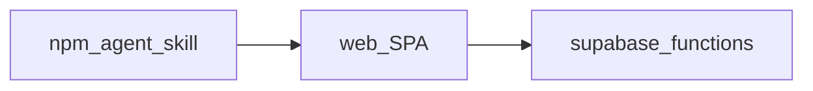

# Architecture

CareerOps is a local-first Career Operating System with three public surfaces in this repo:

| Surface | Path | Role |
|---------|------|------|
| Dashboard SPA | [`web/`](../web/) | Capture memory, board, tailor, interview, offers, portfolio |
| Edge functions | [`supabase/functions/`](../supabase/functions/) | Auth-aware APIs, provider vault, promote RPCs |
| Agent skill | [`packages/careerops`](../packages/careerops) · [`docs/SKILL.md`](SKILL.md) | `npx @telivity/careerops init` and mode workflows |

| Public in this repo | Private to you |
|---------------------|----------------|
| SPA, edge function source, schema SQL, agent skill, training *code* | Live Supabase project, API keys, your career data |
| Model weights on [Hugging Face](https://huggingface.co/telivity/CareerOps-4B) | Training datasets / résumé-derived eval sets |

Deeper deploy and schema notes: [web/README.md](../web/README.md) · [supabase/README.md](../supabase/README.md) · [docs/README.md](README.md).
